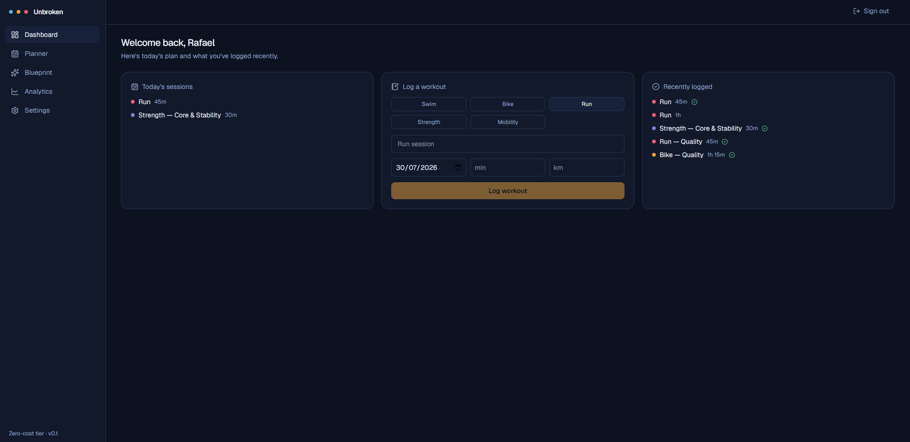
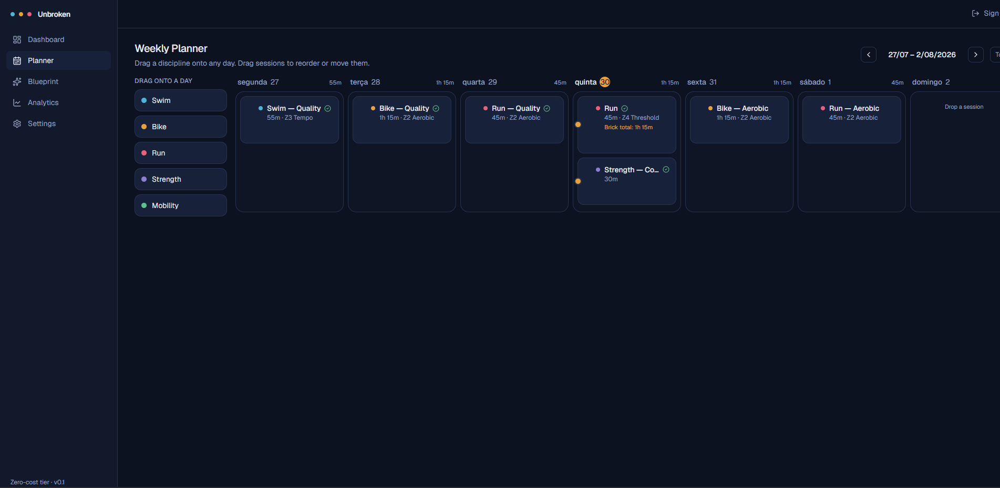
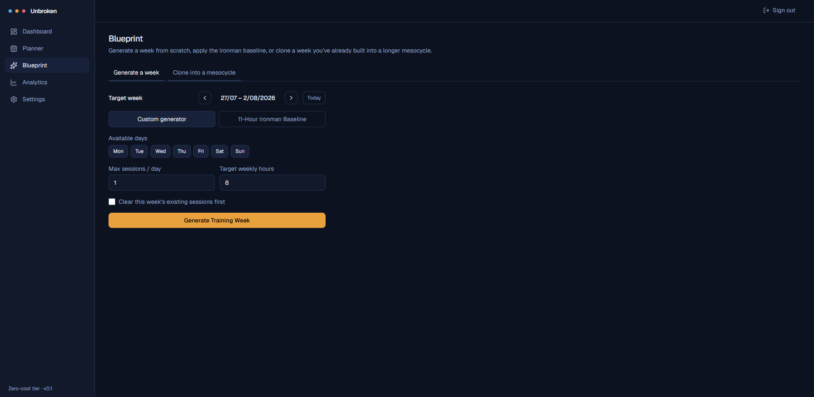
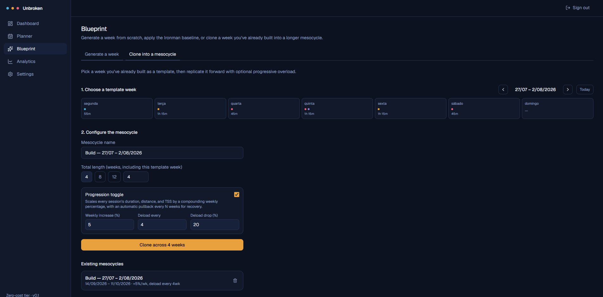
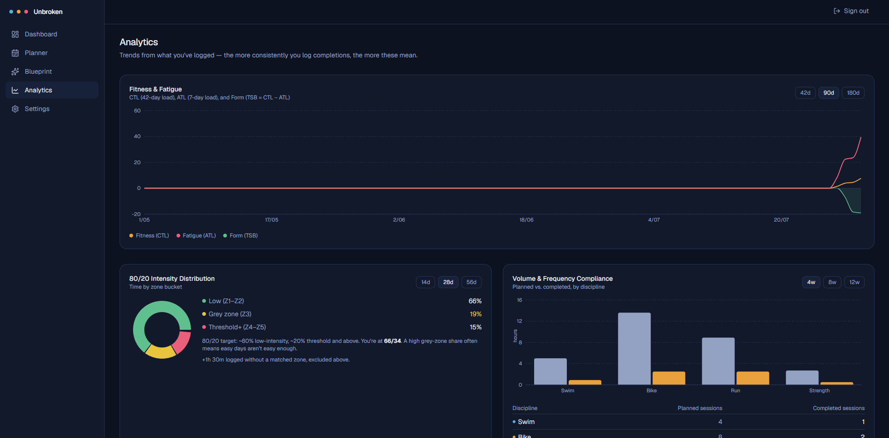
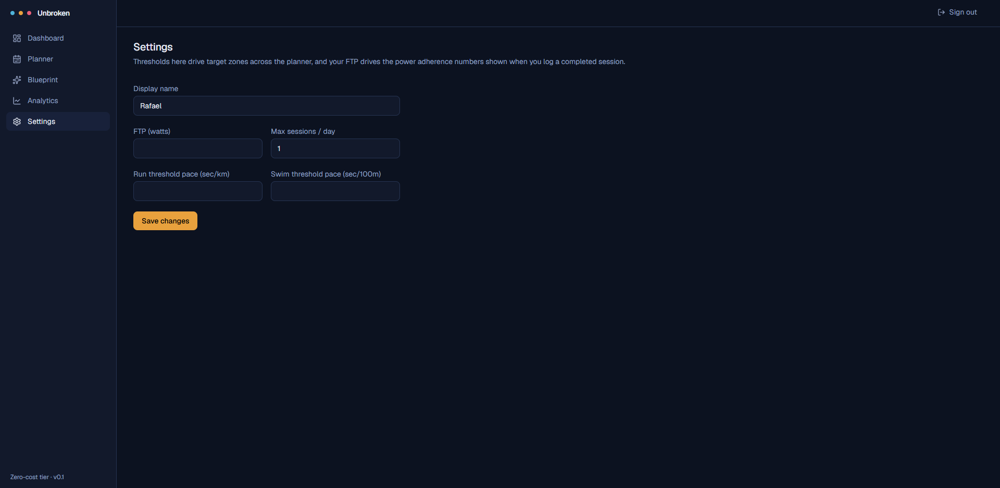
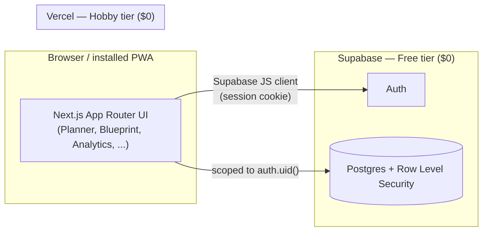

# Unbroken

**A private, zero-cost triathlon planning and performance-tracking app.**

Built for one athlete's own multi-discipline training: unbounded sessions
per day, brick and bolted workouts, mesocycle cloning, an intelligent week
generator with an 11-hour Ironman baseline preset, manual workout logging
with automatic plan reconciliation, and a fitness/fatigue analytics
dashboard — all running on permanent free tiers, with no subscription to
TrainingPeaks, Strava Summit, or (as of mid-2026) Strava's now-paywalled API.

## Contents

- [Screenshots](#screenshots)
- [Features](#features)
- [Tech stack](#tech-stack)
- [Architecture](#architecture)
- [Getting started](#getting-started)
- [Project structure](#project-structure)
- [Further reading](#further-reading)

## Screenshots

| | |
|---|---|
| **Dashboard** — today's plan, quick logging, recent activity | **Planner** — drag-and-drop weekly builder with bricks & bolted sessions |
|  |  |
| **Blueprint — Generate** — constraint-based week generator & Ironman preset | **Blueprint — Clone** — mesocycle replication with progression |
|  |  |
| **Analytics** — CTL/ATL/TSB, 80/20 distribution, compliance | **Settings** — thresholds & availability preferences |
|  |  |

## Features

- **Hyper-personalized calendar** — any day can hold 0, 1, 2, or more
  sessions; never a fixed daily count.
- **Brick Linker** — chain consecutive same-day sessions (e.g. bike → run)
  into one compound event with a combined duration/TSS readout.
- **Bolted Sessions** — attach a short secondary session (e.g. core work)
  directly onto a primary one, rendered as a unified card.
- **Drag-and-drop weekly builder** with reordering and cross-day moves.
- **Mesocycle cloning** — replicate a built week across N future weeks with
  an optional progressive-overload toggle and automatic deload weeks.
- **Intelligent generator** — constraint-based week generation, plus a
  one-click 11-Hour Ironman Baseline Preset that reflows to fit however many
  days you're actually available.
- **Manual logging & reconciliation** — mark a planned session complete, or
  log an ad-hoc workout that auto-matches against the plan; both compute
  duration/distance variance and power adherence.
- **Analytics** — CTL/ATL/TSB fitness-fatigue trend, an 80/20 intensity
  distribution donut with a grey-zone-overtraining callout, and
  planned-vs-completed compliance by discipline.
- **Installable PWA** with offline app-shell caching.

## Tech stack

| Layer | Choice |
|---|---|
| Frontend | Next.js 15 (App Router), TypeScript, Tailwind CSS |
| State | TanStack Query |
| Drag-and-drop | `@dnd-kit` |
| Charts / icons | Recharts, Lucide React |
| Backend | Supabase (Postgres + Row Level Security, Auth) |
| Hosting | Vercel (Hobby tier) |

Every layer above runs on a permanent free tier — $0/month, no third-party
API subscription required.

## Architecture



Every table is scoped by Row Level Security to `auth.uid()`, so the
Supabase anon key is safe to ship to the browser — a user can only ever
read or write their own rows. See
[`supabase/migrations/0001_init.sql`](supabase/migrations/0001_init.sql)
for the full schema and policies.

## Getting started

```bash
npm install
cp .env.local.example .env.local   # then fill in your Supabase keys
npm run dev
```

Full walkthrough (creating the Supabase project, running the migration,
deploying to Vercel) is in **[SETUP.md](./SETUP.md)**.

## Project structure

```
src/
  app/
    (auth)/login, (auth)/sign-up     # unauthenticated routes
    auth/callback                    # Supabase email-confirmation redirect
    (app)/dashboard, planner,        # authenticated shell + pages
         blueprint, analytics, settings
  components/
    shell/                           # sidebar, header, mobile tab bar
    planner/, blueprint/, analytics/,
    dashboard/, settings/            # per-feature UI
  lib/
    supabase/                        # client/server/middleware helpers + types
    planner/, mesocycle/, generator/,
    logging/, analytics/             # per-feature data + business logic
supabase/migrations/0001_init.sql    # full schema + RLS policies
```

## Further reading

- **[SETUP.md](./SETUP.md)** — step-by-step environment setup and deployment.
- **[docs/DEVELOPMENT.md](docs/DEVELOPMENT.md)** — how each feature actually
  works under the hood, including every deliberate simplification (the load
  estimation formula behind Analytics, the brick/bolt data model, the
  auto-matching heuristic behind reconciliation, and why Strava isn't used).
